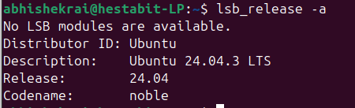
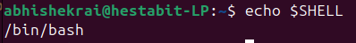
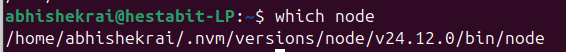
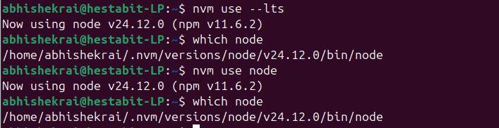
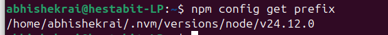
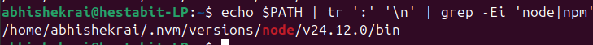
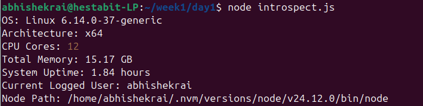
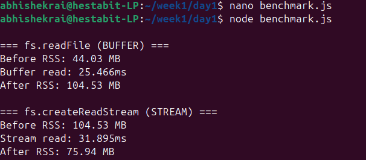
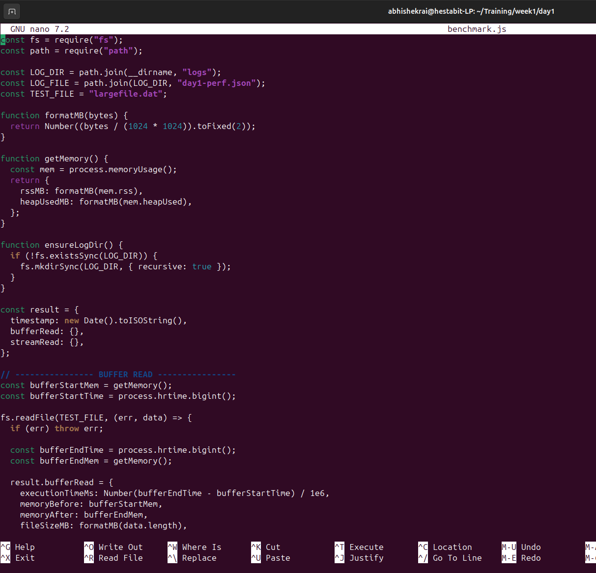

# Day-1 

## Tasks

## 1. Identify and document

### a) OS Version 

Learnings: we used "lsb_release -a"

What is lsb_release -a?

lsb_release -a is a command that tells me exactly which Linux distribution and version I am running. -a is a flag that tells the command show all linux standard base release information  

If we only need the description, we can use "lsb_release -d"

So currently we are using Ubuntu OS with the 24.04.3 LTS version 

Also, if we just need the version we can use "lsb_release -r"

###Note 1: That no lsb module availabe is telling us that there is no lsb modules installed into the current OS versionn but the lsb_release still wworks as now it doesn't need lsb module. 

###Note 2: LSB module is a historical concept where it was a set of specification that made sure that a program written in one linux distribution, works on other distributions as well. Modern Linux solves this using containerization.
 

### b) Current shell

Learnings: What is shell? A shell is a program that acts as an interface between us and the operating system.

OS doesn't understand the commands like ls or cd. It understands system calls. So shell acts as a middle layer.

As for how shell works, it reads your input, parses it check if the input or command is a shell builtin or an executable found in PATH, creates a child process, asks the OS to run the command (Via system command), and it then displays the output.

now there can be multiple shells, ours is bin/bash i.e Bash, which is optimized for Compatibility and power, meaning it works everywhere and with everything and has strong scripting and control features. 

to find the shell we used echo $SHELL, where echo is used for printing and $SHELL indicates what to print. 

### c) Node binary path

This image shows how which node can be used with switching node versions from one version to another. Here both the --lts and the latest node version are same, so it's not particularly visible. This is from Task 2, part 2.

Learnings: Node binary path is the place where our node executable file lives. 

node executable file is a file that runs whenever "node" command is given. It is a executable program

Why do we need this? It actually tells us a lot about node like who installed or controls node, like in our case it's nvm, which node version is exactly running, etc. 

so it helps us debug version conflicts, ensure correct setups for projects avoid mixing sytem node with NVM node, etc. 

we used which node for this. Another command we can use is command -v node

### d) NPM global installation path

The NPM global installation path is the directory on your system where npm installs packages when you use the -g flag. Basically the location on dist where globally installed npm tools live.

why do we need this global? well npm install packages in two scopes, i.e. local and global. Local are project specific and global aresystem wide. Global installs are typically CLI tools or commands you will use everywhere 

to install something globally you use -g tag.

we used the npm config get prefix command to get our global istallation path. This command asks npm's configuration system for the prefix path for global installation '

### e) All PATH entries that include "node" or "npm"     

Now we try to List every directory in your PATH that could affect how node or npm commands are resolved.

We need this because we can have multiple Node installations on one system, but only one wins — the one whose directory appears first in PATH.

the command we use is echo $PATH | tr ':' '\n' | grep -Ei 'node|npm'

How does this command works? 

echo $PATH Prints the full PATH as a single line, tr ':' '\n'Converts it into a readable list, grep -Ei 'node|npm', Filters only lines containing node or npm

## 3. Create script introspect.js that prints:

OS:
Architecture:
CPU Cores:
Total Memory:
System Uptime:
Current Logged User:
Node Path:

## 4. STREAM vs BUFFER exercise (performance benchmark)
○ Create a large test file (50MB+)
○ Read file using both:
■ fs.readFile (Buffer)
■ Stream (fs.createReadStream)
○ Capture execution time + memory usage

