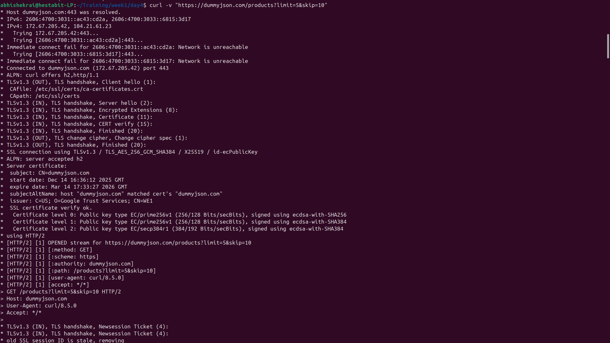
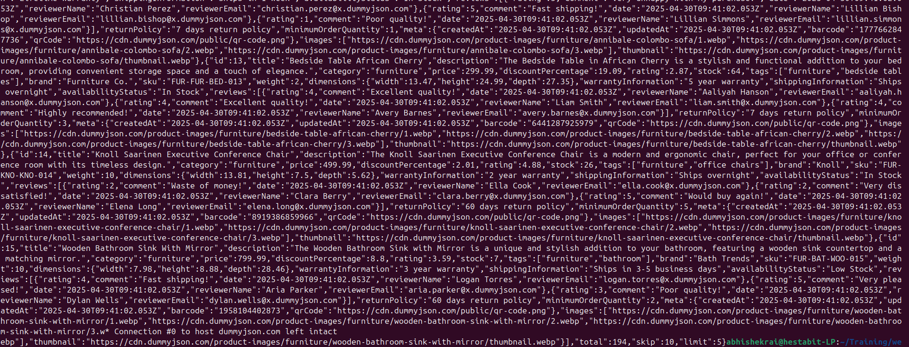
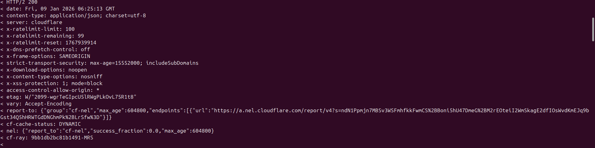
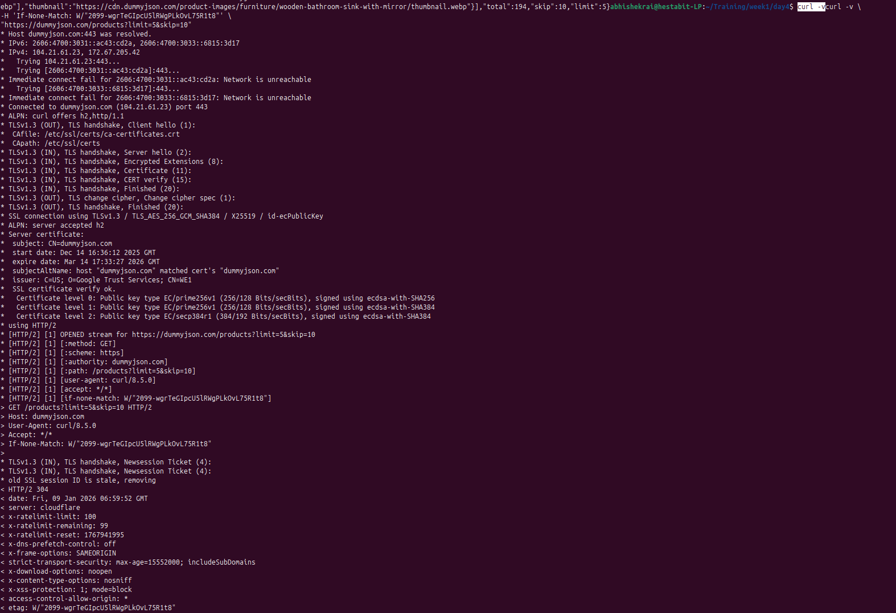
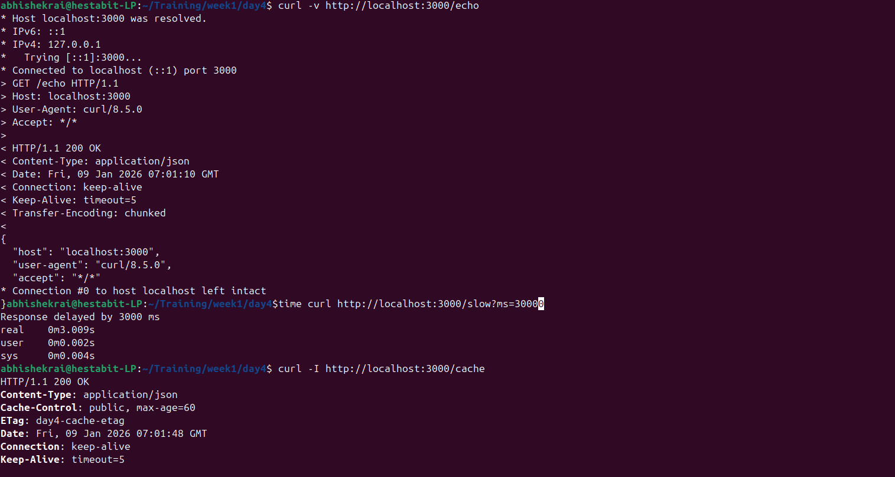

# API Investigation — Day 4

## Pagination
The API uses limit and skip query parameters to paginate results.

## Headers Observed
- User-Agent
- Authorization
- Content-Type
- Cache-Control
- ETag

## Header Manipulation Results
Removing User-Agent did/did not affect response.
Fake Authorization header was ignored by the public API.

## Caching Behavior

ETag was returned by the server.
When re-sent using If-None-Match, server returned 304 Not Modified.

## Request–Response Cycle
Client sends request with headers → server responds with status, headers, and body.
Caching headers allow clients to avoid downloading unchanged data.

