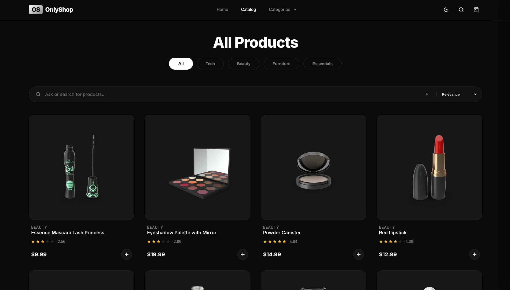
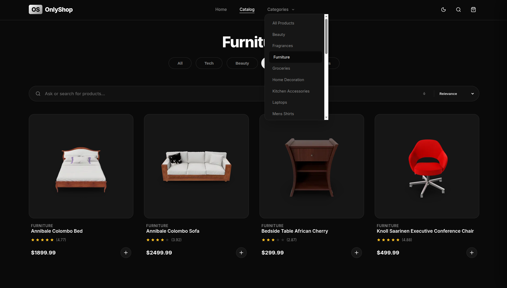
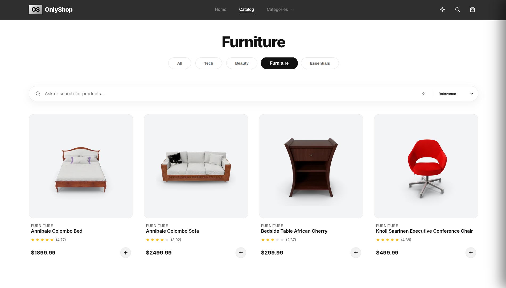

# Day 5 E-Commerce website

On day 5 we had to make a e-commerce website that was fully functional. 

## The Process 

- We started with the html code to build the structural skeleton, establishing the navigation, hero section, and grid containers. We started with the product page and then added the home page later, after the product page's structure was established. 

- Then after a basic structure was created we moved on to css to first make sense of the html. We started with dark mode first (later we will also apply the light mode.) as it is easier on the eyes (matte black shade).

- Then we moved on to the logic part and the heart of the mini project, JS. in js we first created a array which will store all the produscts, and we called it inventory

- Then we went ahead and took a look at the dataset or the json file we were dealing with. We identified that the API returns a root object containing a products array, which was crucial for understanding how to correctly extract and map the data.

- We then used the fetch api to fetch the data from dummy.json endpoint, stored it in data, which was later stored in inventory array object by object. using "data.product" (which was the array we identified), and finally enclosed this in an try catch block. (learnt try catch on day 4).

- Then for dynamic rendering we created a helper function called createProductCard which is sued to render product cards dynamically. So even if the data changes, the grid will be re-loaded automatically. 

- Then comes our master stroke, the unified filtering logic. We created a single filtering function called applyFilters. We created a list array inside it and stored everything from inventory inside it using the spread datastructure (...inventory). This helps us navigate through pages and different types of products without having to create different pages. 

- We developed the shopping cart logic with state persistence. We used a simple array of objects for the cart items and utilized localStorage to save the cart state. This ensures that even if the user refreshes the page, their selected items remain. (Learnt on Day 4).

- Finally, after the functionalities we done(main one's atleast) we came to design. We wrote a custom function to calculate the mouse position relative to the center of each card to apply the 3D tilt transform.

- We added a light mode functionality as well. And further design changes. 

## Learnings

- How fetch works:  I learnt that the Fetch API is the modern way to retrieve data from a server over the network. It doesn't return the data immediately, instead, it returns a Promise that lets the browser know something is coming, allowing the rest of the page to load without freezing.(We saw the concept in week 1 as well.).

- Why we need await with fetch: Since Fetch is asynchronous , the code would normally skip over it and try to render empty data. By using the await keyword, we force JavaScript to pause execution of that specific line until the Promise resolves and the actual data arrives, preventing "undefined" errors. meanwhile the main thread moves ahead and loads other part of the code.

- How to apply filters adn how to render things according to that: I learnt that filtering is about manipulating data. By creating a shallow copy of the master inventory (using spread (...array)), filtering that specific array, and then clearing and re-rendering the HTML grid, we can create complex search and sort features that feel instant to the user without reloading the page.

- How to read a dataset and code according to it: Writing code blindly doesn't work. I learned the importance of inspecting the JSON structure first (e.g., realizing the array was nested inside data.products rather than being the root object). This structure dictates exactly how we write our loops and variable assignments.

- How to apply tilt on card using event listeners and math: I learned that interactive design often involves geometry. By capturing the mouse's X and Y coordinates and comparing them to the center of the card element, we can calculate a rotation degree. Injecting this calculated value into CSS transforms creates a physics-based 3D effect that follows the cursor.

## Website preview(screenshots)

;
;
;
;