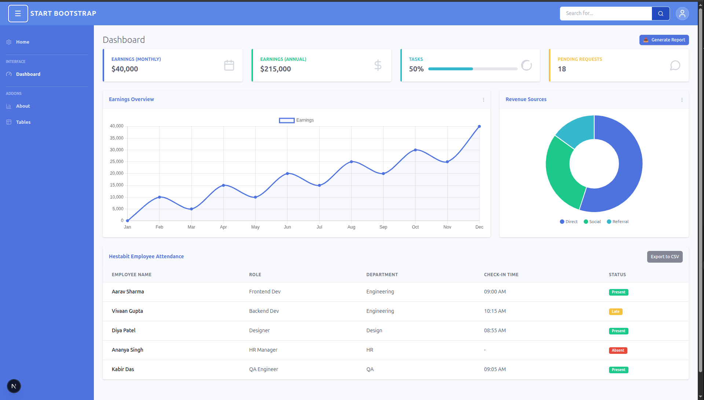
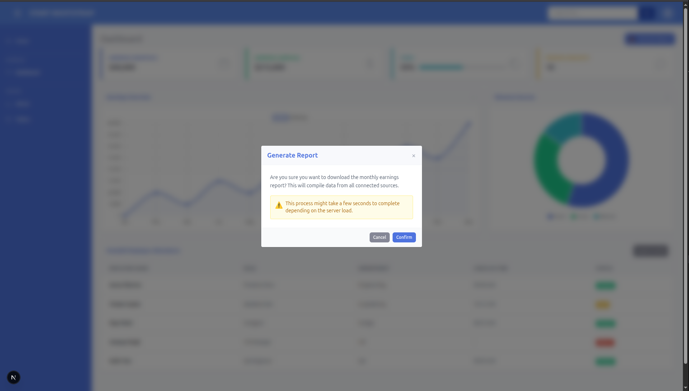
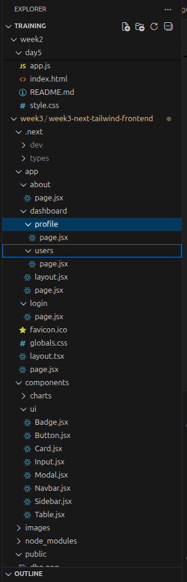
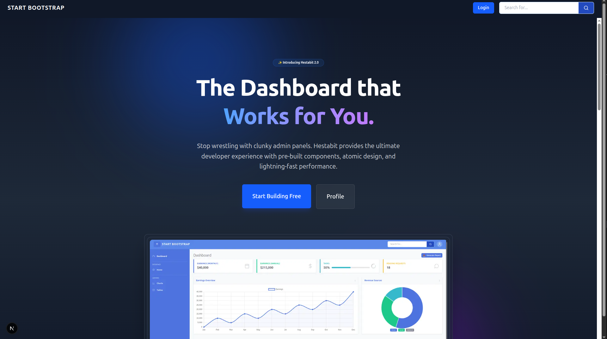
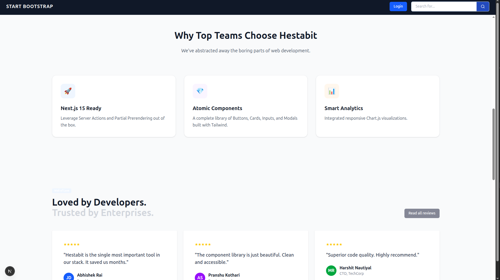
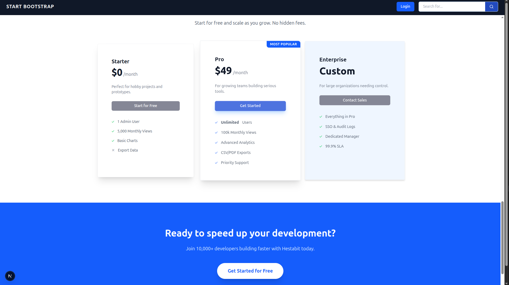
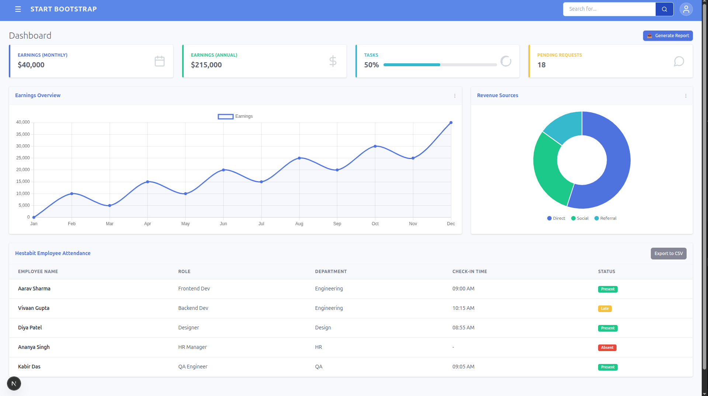
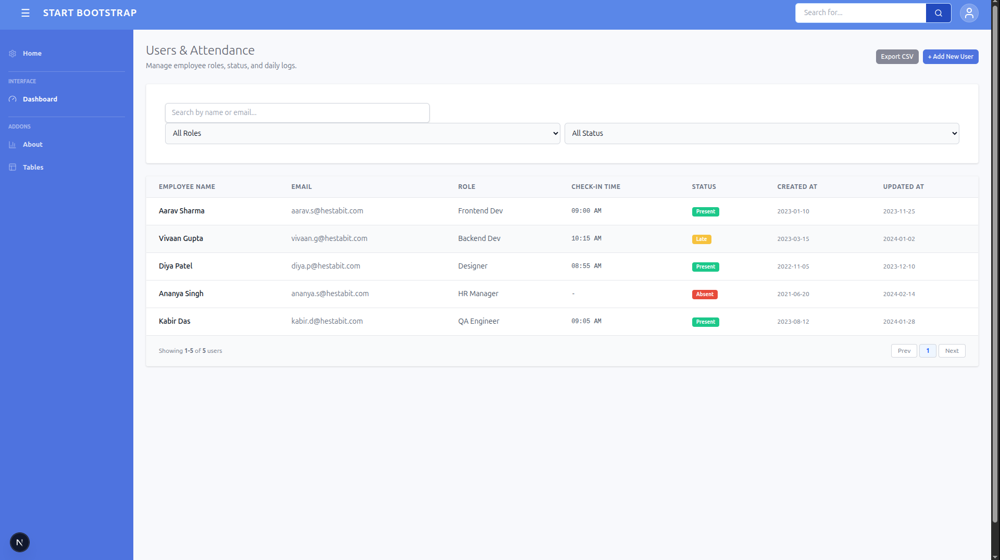

# 🚀 Week 3: Advanced Frontend (Next.js + Tailwind CSS)

## Objective
Train interns to build modern, production-grade frontends using **Next.js 15** and **Tailwind CSS**.  
This week focuses on moving from basic React SPAs to a **server-first architecture** with a **reusable design system**.

---

## 📂 Project Overview

This repository tracks the evolution of a **Dashboard Application** built over **5 days**.  
It progresses from a static HTML/CSS skeleton to a fully dynamic, multi-page **Next.js application** with a component library and an optimized landing page.

### Tech Stack
- **Framework:** Next.js 15 (App Router)
- **Styling:** Tailwind CSS (Utility-first)
- **Language:** JavaScript / JSX
- **Architecture:** Atomic Design (Atoms → Molecules → Organisms)

---

## 📅 Daily Progress & Deliverables

### 🔹 Day 1: Tailwind CSS Setup & System Basics

**Focus:**  
Setting up the environment and understanding the utility-first mindset.

**Key Learnings:**
- Utility-first styling: Moving away from semantic class names to utilities  
  (`w-64 h-screen bg-blue-600`)
- Spacing system: Consistent scale using `p-4`, `m-2`, `gap-4`
- Custom theme configuration: Extending `tailwind.config.js` with brand colors
- Responsive design: Using breakpoints (`sm:`, `md:`, `lg:`) without media queries

**Deliverables:**
- Installed Tailwind in a Next.js environment
- Built the dashboard skeleton (Fixed Sidebar + Sticky Navbar)


---

### 🔹 Day 2: Component Architecture & Atomic Design

**Focus:**  
Thinking in components and building a reusable UI library.

**Key Learnings:**
- Component composition: Atoms → Molecules → Organisms
- Flexbox and Grid:  
  - `flex` for alignment  
  - `grid` for structured layouts
- Reusable components with props (`variant`, `size`)
- Clean folder organization (`/components/ui`, `/app`)

**Deliverables:**
Created a `components/ui` design system:
- **Button:** Primary and danger variants
- **Card:** Dynamic colored border logic
- **Input:** Labels with focus states
- **Badge:** Status indicators
- **Modal:** Backdrop and keyboard accessibility


---

### 🔹 Day 3: Next.js Routing & Layout System

**Focus:**  
Mastering the App Router and file-based routing.

**Key Learnings:**
- App directory structure and special files (`layout.js`, `page.js`)
- File-based routing (`/dashboard/profile`)
- Nested layouts:
  - `app/layout.js` → wraps the entire app
  - `app/dashboard/layout.js` → wraps only the dashboard
- Client vs Server Components:
  - `"use client"` for interactivity
  - Server Components for performance
- Navigation using `<Link>` and `useRouter`

**Deliverables:**
- Refactored into a multi-page application
- Implemented nested layouts
- Built an App Shell pattern for sidebar state



---

### 🔹 Day 4: Dynamic UI & Optimization

**Focus:**  
Polishing the application to production standards.

**Key Learnings:**
- Image optimization using `next/image`
- Font optimization using `next/font`
- SEO with the Metadata API
- Micro-interactions using Tailwind transitions  
  (`hover:scale-105`, `duration-300`)

**Deliverables:**
- Responsive SaaS landing page (Hero, Features, Pricing)
- Integrated Chart.js for data visualization
- Added hover effects and animations





---

### 🔹 Day 5: Capstone Mini Project

**Focus:**  
Integrating all concepts into a cohesive UI-only application.

**Project Scope:**  
A complete multi-page frontend with no backend, demonstrating real user flows.

**Pages Implemented:**
- `/` – High-conversion landing page
- `/login` – Centered authentication UI using Card component
- `/dashboard` – Data-rich overview with charts and widgets
- `/dashboard/users` – User table with pagination and status badges




---

## 📂 Folder Structure

```bash
week3-next-tailwind-frontend/
├── app/
│   ├── layout.jsx                # Root layout (HTML + Body shell)
│   ├── globals.css               # Tailwind base, components, utilities
│   ├── page.jsx                  # Landing page
│   ├── login/
│   │   └── page.jsx              # Login page
│   └── dashboard/
│       ├── layout.jsx            # Dashboard layout with sidebar
│       ├── page.jsx              # Dashboard home
│       └── users/
│           └── page.jsx          # Users management table
│
├── components/
│   ├── app-shell.jsx             # Client-side wrapper for sidebar state
│   ├── charts/
│   │   ├── line-chart.jsx        # Line chart wrapper
│   │   ├── bar-chart.jsx         # Bar chart wrapper
│   │   └── pie-chart.jsx         # Pie chart wrapper
│   └── ui/
│       ├── button.jsx            # Button atom
│       ├── card.jsx              # Card molecule
│       ├── input.jsx             # Input field with label
│       ├── badge.jsx             # Status badge
│       ├── modal.jsx             # Accessible modal
│       ├── navbar.jsx            # Top navigation bar
│       ├── sidebar.jsx           # Dashboard sidebar
│       └── table.jsx             # Reusable data table
│
├── public/
│   ├── images/                   # Static images
│   └── icons/                    # SVG icons
│
├── tailwind.config.js
├── postcss.config.js
├── next.config.js
├── package.json
└── README.md
```


---

## 🚀 How to Run

1. Clone the repository
2. Install dependencies:
- npm install
- npm install chart.js react-chartjs-2
3. Start the development server:
- npm run dev
4. Open the app:
- http://localhost:3000