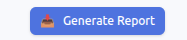
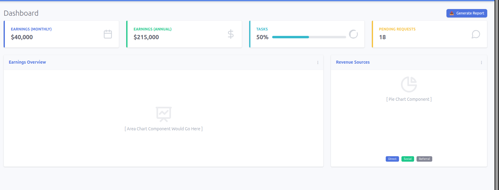
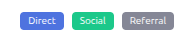
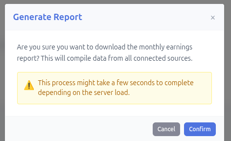
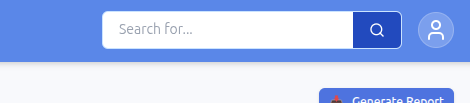

# UI Component Documentation

## Button.jsx

### Purpose
A reusable button component with multiple variants and sizes for consistent styling across the dashboard.

### Contribution
- Provides unified button styling across the entire dashboard
- Offers multiple color variants and sizes for different use cases
- Includes focus states and proper keyboard navigation for accessibility
- Provides hover effects and transitions for visual feedback

## Card.jsx

### Purpose
A flexible card container component that wraps content with consistent styling, border options, and shadow effects.

### Contribution
- Creates uniform card containers for all dashboard sections
- Uses colored left borders to visually categorize different data types
- Provides flexible padding control for various content layouts
- Adds professional depth and organization with shadow and border effects

## Badge.jsx

### Purpose
A small, inline labeling component for categorization, status indicators, and legend items.

### Contribution
- Provides clear, compact labels for categories and status information
- Enables quick visual identification with color-coded variants
- Maintains consistency with the overall design system color palette
- Adds information without disrupting the page layout

## Modal.jsx

### Purpose
A dialog box component for displaying important actions and confirmations with backdrop blur and animations.

### Contribution
- Creates a focused interface for important actions without leaving the page
- Requires explicit confirmation before executing critical actions
- Provides smooth animations, backdrop blur, and keyboard escape support
- Includes accessibility features (escape key support and click-outside closing)
- Reuses Card and Button components internally for design consistency

## Input.jsx

### Purpose
A form input component with label support and consistent styling for form fields.

### Contribution
- Ensures uniform styling for all input fields across forms
- Provides proper label association for accessibility and screen readers
- Delivers visual feedback with focus states using custom ring color
- Supports disabled state styling for inactive inputs
- Ready for form validation and error message extensions

