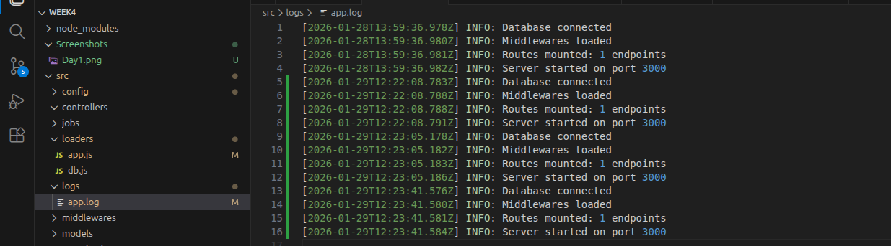

# Day 1 

## Architechture Used

``` bash
root
├── config/             # Environment variables and configuration objects
├── src/
│   ├── loaders/        # Startup scripts (DB connection, Express setup, Logger)
│   ├── models/         # Database schemas and type definitions (Metadata)
│   ├── routes/         # API Route definitions (endpoints)
│   ├── middlewares/    # Express middlewares (Auth, Validation, Error handling)
│   ├── controllers/    # Request handlers (Input/Output only)
│   ├── services/       # Business logic (The "Brain" of the app)
│   ├── repositories/   # Data Access Layer. Contains Direct DB queries
│   ├── jobs/           # Scheduled tasks and Cron jobs
│   ├── utils/          # Generic helper functions (formatting, math, etc.) contains logger.js
│   └── logs/           # Local log files (error.log, combined.log) created by logger.js
├── index.js              # Application entry point
└── ARCHITECTURE.md     # This is documentation
```

## 3 Layered Architechture

### Layer 1: Config

---

the config layer is taking the data from the env file, which we specify in the terminal and putting it into the dotenv function which parses the values into key=value pair and we log the particular file in the current directory, then we export it. 

---

### Layer 2: Setup

---

In the setup Layer we setup everything. First we write the app.js and db.js in the loaders section, which are the startup scripts and the core of our application. 
we also add loggers.js in utils to create logs for tracking if everything is working

---

### Layer 3: Orchestration

---

In the orchestration layer we create a index.js in src folder which willstart everthing by starting the loaders file and put everything into action 

---

Result: 

