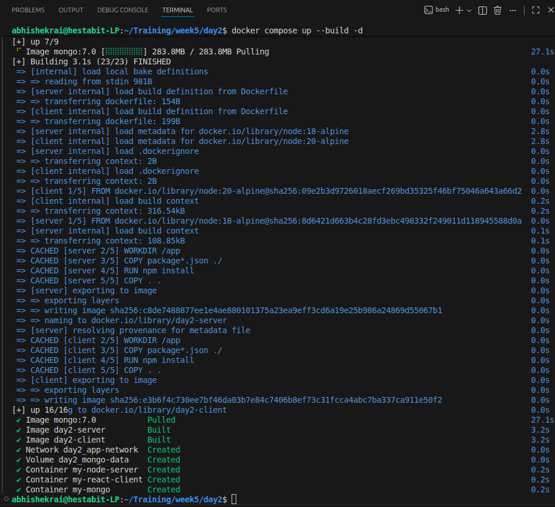
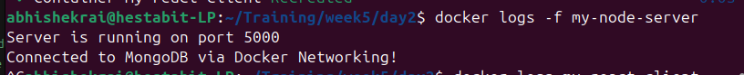
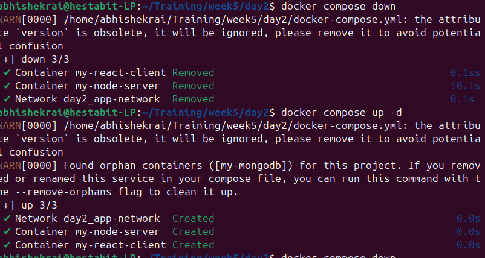
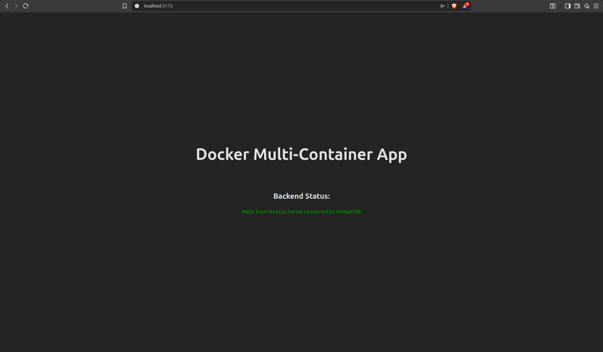

# Day 2

On day 2 we have studied a very important docker concept, orchestration using `docker-compose.yml`. 
if we have more than 1 parts in our projects that we want to create a dockerfile for, like `server`, `client`. so instead of creating them one by one we create one compose file. 
Also, it connects two docker containers via a `network`, so that they can communicate over that network. 

## Creation of compose file

First we create the `docker-compose.yml` in the root folder. For every container, we keep a different folder. namely `client` and `server`. inside these folders we create seperate dockerfiles to make their containers. 

now we make images in compose by giving them names first 

these are the names we are going to use when we try to access these containers. In our compose file we used `mongo`, `server`, `client`

These are called `Service names`. Docker, takes these service names and automatically regiters them inside the internal DNS service system of the docker network. meaning instead of that containers IP it uses these service names. 

Note: This only works inside the internal network of the compose file

Now, if we have a dockerfile we only need to write `build`:`./foldername_where_the_Dockerfile_is`

otherwise we will use `image`:`the image + version` 

then we use other tags like `ports` to define the ports and the mapping of the oyter port to the container ports. 

## Docker networks

 `Docker Networking` is like the virtual cables and routers that connect your containers to each other and to the outside world.

 Without networking, your containers are just isolated boxes floating in a black void. Networking allows them to talk.

 the default network type is the `bridge`. This is quite isolated, as inside the network the different containers can communicate with each other but they can't connect with the outside world without the mapping

 Then there are other types of networks like `Host Network` whihc has the same ip as you r computer, and the `None network` with no access.

 ## Docker Volumes 

 `Docker Volumes` are the external harddrives for your docker world. 
 `Docker compose` is by default amnesiac. meaning if you delete it the files will be delted by it, or if you stop it you will not be able to access the files. docker volume helps us solve that. 

 we did exactly that in our compose and created  a volume called `mongo-data` which we use to store data from mongo db database 


## BUilding the Commpose

to build a compose file you come to the root directory and run 

```
docker compose up --build -d
```




to check the logs 

```
docker logs -f my-node-server
```




compose up and down 

```
docker compose down
dowker compose up

```




Outputs

`client`


`server`

