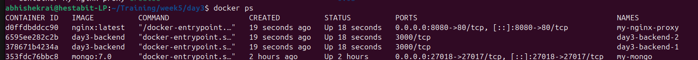
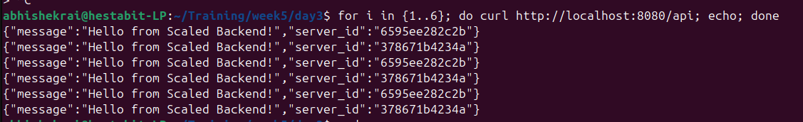

# Day 3

## Nginx 
 
`Nginx` is a "doorman" to the server.js. it can be used for multitudes of functionalities. It handles security and traffic. Most important part is the `load balancing` part. nginx ditributes the traffic across multiple servers in a very efficient way.

## nginx.conf

`nginx.conf` is like the rulebook for nginx. nginx works on the basis of conf file.

what is happening in the nginx.conf?

- We first define the limit of the nginx worker process that will handle users simultaneously. Meaning at a time nginx worker can only handle this amount of users 

```
events {
    worker_connections 1024;
}
```

- Then we define Groups for servers 

```
upstream backend_servers {
        server backend:3000;
    }
```

Here we use upstream, as it is a specific feature that unlocks load balancing. To be specific, you can tell NGINX to send more traffic to the one server you desire by using weighted load balancing. 

and by saying server we are saying that this path needs to be added inside the group. When we say path, it  looks for the ip `backend` in the `docker networks` (as nginx is running there as well). that are running on the port 3000 and then adds them to the group. 

- Now we define the rules of the server 

```
server {
        listen 80;

        location / {
            return 200 'Welcome to NGINX Gatekeeper!';
        }

        # Route /api requests to the upstream group
        location /api {
            proxy_pass http://backend_servers;
            proxy_set_header Host $host;
            proxy_set_header X-Real-IP $remote_addr;
        }
    }
```

Now here we define that the servers will  listen on the port 80 of the container, which we later mapped with the port 8080 of the outside the container in the compose file. 

then we set the routes and what to do on those routes. 

so the first route is only working on `/` of `8080` port. 

Then comes the `/api`. Now whenever someone visits `localhost:8080/api` they will get the middle man treatment here. The request will then be passed on to the backend_servers server group. this is done by the line `proxy_pass http://backend_servers` where the load balancing will be done using the upstream. 

then we set the host to be `localhost:8080` instead of `backend_servers` as has been provided in the proxy pass. This removes the confusion that the server will have when redirecting in the future. 

## Outputs

Made two backend containers



Alternating between the the containers servers

