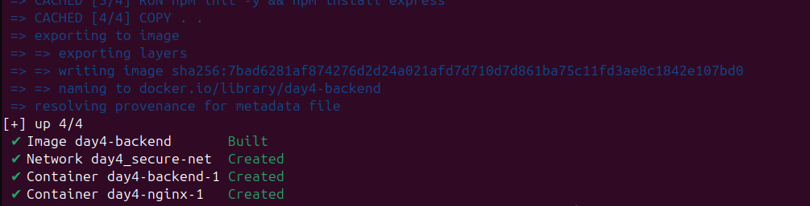
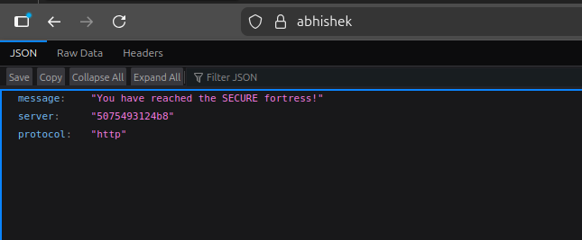

# Day 4 

# What is ssl 

SSL is a standard security technology that establishes an encrypted link between a `web server` (website) and a `browser` (user). This link ensures that all data passed between the web server and browsers remains private and integral.

In this setup, we are implementing SSL Termination. This means NGINX handles the heavy lifting of encryption and decryption at the door, while the backend servers behind it continue to talk in plain HTTP.

# mkcert

To make this work locally without our browsers screaming "Unsafe!", we used a tool called mkcert. It acts as a local Certificate Authority (CA) that our computer trusts, giving us that valid green lock icon.

```
mkcert -key-file ./certs/key.pem -cert-file ./certs/cert.pem localhost 127.0.0.1 abhishek
```

## nginx.conf (the layer which secures)

nginx.conf is now handling two jobs: forcing users to be secure, and actually handling the secure conversation.

**what is happening in the nginx.conf?**

First, we defined the "Redirect" Server. This listens on the insecure HTTP port (mapped to 81 externally).

```
# SERVER BLOCK 1: HTTP (Port 81)
    server {
        listen 81;
        server_name localhost abhishek;

        location / {
            # 301 = Permanent Redirect
            return 301 https://$server_name$request_uri;
        }
    }
```

Here, we are being very strict. If anyone tries to come in via HTTP, we immediately tell them "Move Permanently" (301) to the HTTPS address. We use $server_name instead of $host here to avoid the "Redirect Trap" where NGINX might accidentally redirect to https://localhost:8081 (which is invalid).


Then, we defined the actual Secure Server on Port 443.

```
# SERVER BLOCK 2: HTTPS (Port 443)
    server {
        listen 443 ssl;
        server_name localhost abhishek;

        # SSL Configuration
        ssl_certificate /etc/nginx/certs/cert.pem;
        ssl_certificate_key /etc/nginx/certs/key.pem;
```

Finally, we pass the traffic to the backend, but with extra notes attached.

```
location / {
            proxy_pass http://backend_servers;
            
            proxy_set_header Host $host;
            proxy_set_header X-Real-IP $remote_addr;
            proxy_set_header X-Forwarded-Proto https;
        }
```

## Output


