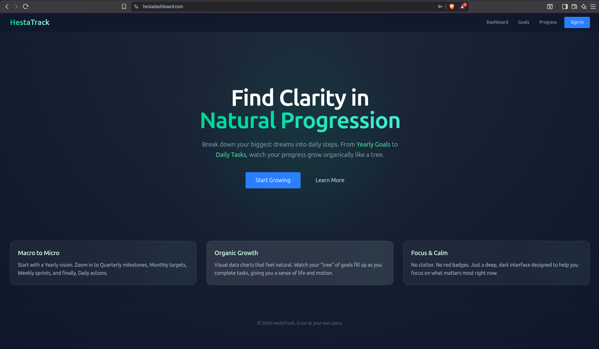
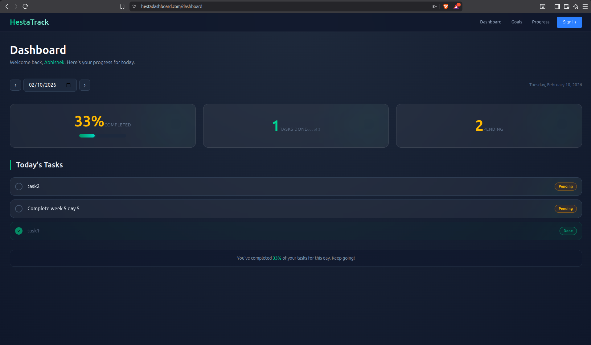
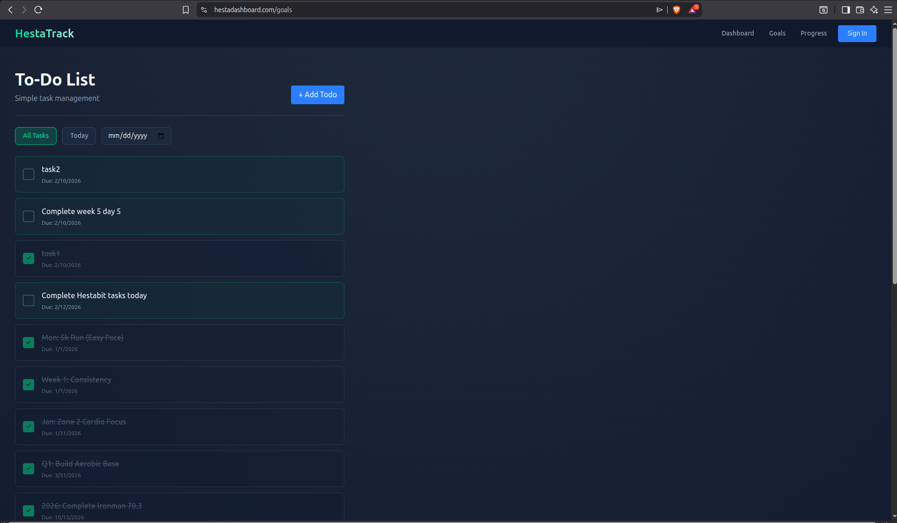

# HestaTrack Production Guide

Here is how we get the HestaTrack dashboard up and running. We use Docker Compose to orchestrate the backend, frontend, and database, with Nginx handling the traffic and SSL.

### 1. Prerequisites

Before we start, we need to ensure these are installed on our machine:

* **Docker & Docker Compose** (To containerise everything)
* **mkcert** (For generating valid local SSL certs)
* **Node.js** (Optional, but good for running the seed script locally if needed)

### 2. Folder Structure

We need to verify our directory looks like this so the volumes map correctly:

```text
/week5/day5/
├── client/          # Next.js Frontend
├── server/          # Express Backend
├── nginx/           # Nginx Configuration
├── certs/           # SSL Certificates (Generated auto-magically)
├── deploy.sh        # The deployment script
└── docker-compose.yml

```

### 3. Environment Setup

We create a `.env` file in the `server` folder if we haven't already.

**File:** `server/.env`

```ini
PORT=5000
MONGO_URI=mongodb://mongo:27017/hestatrack

```

### 4. SSL Certificates

We need HTTPS for this to work properly (browser security and all that).
We run this in our terminal to generate the certificates in the `certs` folder:

```bash
mkdir certs
cd certs
mkcert -key-file key.pem -cert-file cert.pem localhost 127.0.0.1 hestadashboard.com

```

*(Note: The `deploy.sh` script actually does this for us, but it's good to know how it works).*

### 5. Hosts File

Since we are using `hestadashboard.com` locally, we need to tell our computer to look at itself.

We open our hosts file:

* **Mac/Linux:** `sudo nano /etc/hosts`
* **Windows:** Run Notepad as Admin -> `C:\Windows\System32\drivers\etc\hosts`

We add this line at the bottom:

```text
127.0.0.3 hestadashboard.com

```

### 6. Deployment

We use the script I created to handle the build, certification, and database seeding in one go.

We run this from the root folder:

```bash
chmod +x deploy.sh
./deploy.sh

```

**What this script does for us:**

1. Checks if we have Docker and mkcert.
2. Generates keys/certs if they are missing.
3. Builds the images and starts the containers in detached mode.
4. Waits for the Database and Backend to be healthy (no more connection errors).
5. Seeds the database with the Career and Ironman goals.

### 7. Verification

Once the script says "Deployment successful", we check these URLs:

* **Frontend:** [https://hestadashboard.com](https://www.google.com/search?q=https://hestadashboard.com)
* **API:** [https://hestadashboard.com/api/goals](https://www.google.com/search?q=https://hestadashboard.com/api/goals)

### 8. Troubleshooting

If something breaks, we check the logs.

**View all logs:**

```bash
docker compose logs -f

```

**View specific service logs:**

```bash
docker compose logs -f backend
docker compose logs -f frontend

```

**Restart everything:**

```bash
docker compose down
docker compose up -d

```

# Output

- Landing page



- Dashboard



- Goals 

