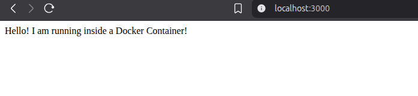
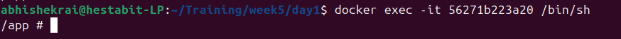
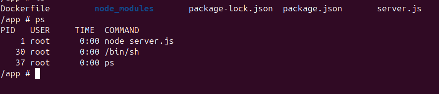
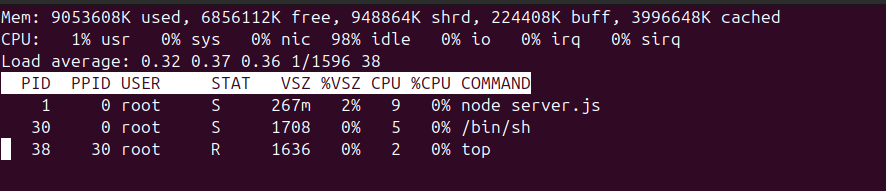
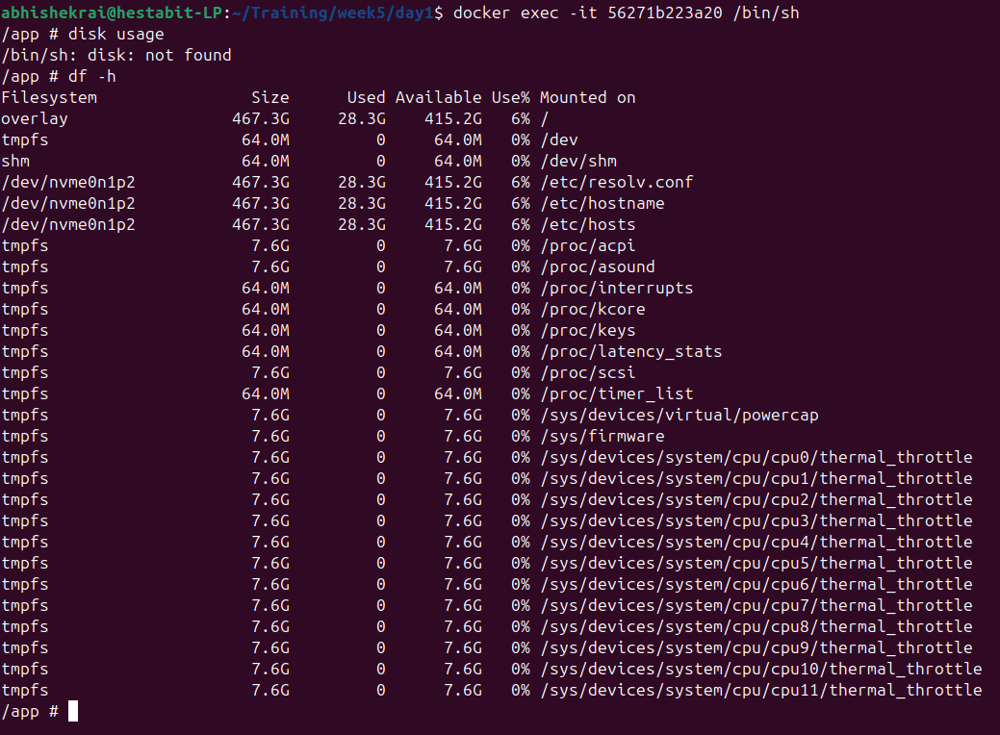
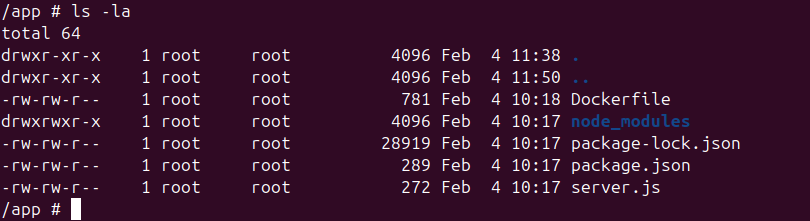

# Day 1


## Installing Docker 

For the day 1 we worked on the basics of docker, and how to make a `Dockerfile`
First we installed docker on our laptop using command:

```
sudo install -m 0755 -d /etc/apt/keyrings

curl -fsSL https://download.docker.com/linux/ubuntu/gpg \
  | sudo gpg --dearmor -o /etc/apt/keyrings/docker.gpg

sudo chmod a+r /etc/apt/keyrings/docker.gpg

```
this adds docker official GPG key, making sure the files come from docker. 

then we used this command: 

```
echo \
  "deb [arch=$(dpkg --print-architecture) signed-by=/etc/apt/keyrings/docker.gpg] \
  https://download.docker.com/linux/ubuntu \
  $(. /etc/os-release && echo "$VERSION_CODENAME") stable" \
  | sudo tee /etc/apt/sources.list.d/docker.list > /dev/null

```
This tells ubuntu, where to download docker from. 

And then we use this to install docker

```
sudo apt install -y docker-ce docker-ce-cli containerd.io docker-buildx-plugin docker-compose-plugin
```

## Docker and learnings 

Docker is a containerization tool that we use to wrap up our application inside a pre-made environments, so that we don't need to install those environments in other computers to run the code base. 

It uses `Images` to make these containers, or we can say the environments. 

Images: these are the fundamental building blocks, that serve as the template or a static stopeed in time container, for when you run the container it "unfreezes" this image and make it a live container or in our context a "video". 

the images are fetched either locally or from the docker hub, if now available locally. Docker reads the docker file and then fetches the image. 

After the build the images are generally stored in the docker/overlay2 folder, which is the cache. 

- Commands we have used to build a container and run it:

to build image

```
docker build -t my-node-app .
```

to run container 

```
docker run -p 3000:3000 my-node-app
```

This runs the code and the code works


## Docker shell

Docker containers has their own shell that we can use to see the working of the container images. 
the command we use to enter it

```
docker exec -it <container> /bin/sh
```

this effectively opens a terminal session for the container that we are working with

`docker exec` is used to run a new command in the running container. 
`-it` these are two commands 'i' for keeping the input open even if not attached and 't' to allocate a pseudo terminal 

then we give the container id in which we want to run this command, and after that we give specific command shell we want to give, here we gave `bin\sh`

you can also run other shells like bash if you are using the ubuntu environment. 




We then test the container terminal by runnning different commands. 

- `ls & ps`



- `top`



- `disk usage`



- `logs`



