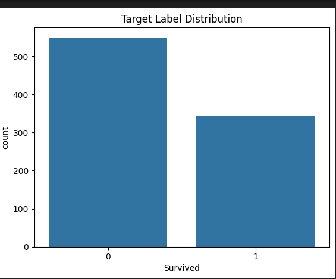

# Day 1 

In Day 1 we mainly focused on how we read data, how we process data by setting up a pipeline, how we can peform some operations on data using EDA to summarise and better understand the data. 

## How we read Data

The raw form of a data is provided in the form of a csv file. The data is devided into Rows and columns . The column tell's us what the data is, and row tell's us who that data is about. In every data, there is a unique identifier. that tells us  who that data is about. But when we perform ml algorithms for prediction, we don't usually need these unique identifiers, we usually need them when we want to remove the duplicate values. After that we can either keep them or remove them, mostly, we keep them and then work with the columns we need to work with when doing predictions. 

## 3. Data Cleaning Log
The following automated steps were executed by `src/pipelines/data_pipeline.py`:

### Dropped Columns
* **Identifiers:** Removed `PassengerId`, `Name`, `Ticket` as they provide no predictive signal.
* **High Missingness:** Removed `Cabin` (Too many missing values to impute reliably).

### Imputation Strategy (Missing Values)
* **Numerical Features (e.g., Age):** Filled using **Median** (Value: `[e.g., 28.0]`) to be robust against outliers.

`Note` : outliers are the values that are extremely different from the rest of the data.

**Categorical Features (e.g., Embarked):** Filled using **Mode** (Value: `[e.g., 'S']`).

---

## 4. EDA Insights (Exploratory Data Analysis)

### Target Distribution (`Survived`)
- **Class Balance:**
    * Class 0 (No)
    * Class 1 (Yes)
    : 

* **Insight:** The dataset is `Imbalanced`. 

### Correlation Analysis
* **Strongest Positive Correlation:** `[Parch]` vs `[SibSp]` (Correlation: `0.41`).
* **Strongest Negative Correlation:** `[Pclass]` vs `[Fare]` (Correlation: `-0.55`).
* **Multicollinearity Check:** No two features had a correlation > 0.9.

### Feature Distributions
* **Numerical:** `Age` follows a roughly normal distribution. `Fare` is highly right-skewed .
* **Categorical:** `Sex` has two unique values. `Embarked` has three.

---

## 5. Visual Proofs
Refer to `notebooks/EDA.ipynb` for full charts

- Missing Values Heatmap: Verified "Before" (messy) vs "After" (clean).
- Correlation Matrix: Identified key drivers for the target variable.
- Distribution Plots: Confirmed need for scaling in Day 2.

---

