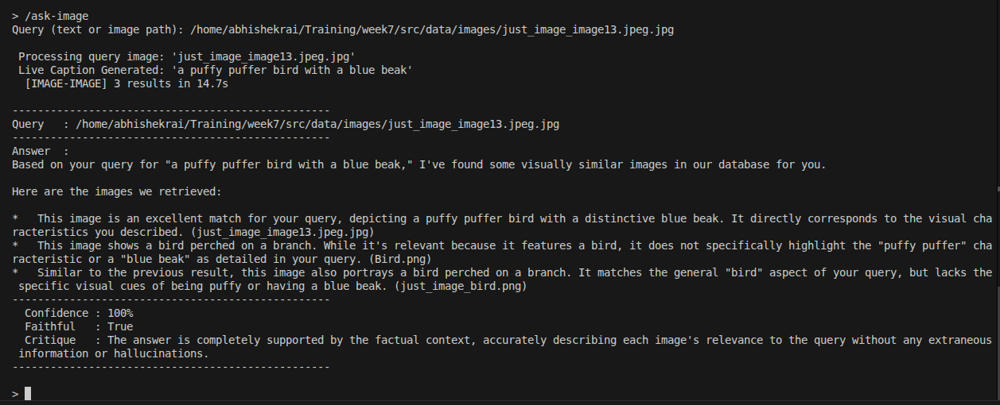
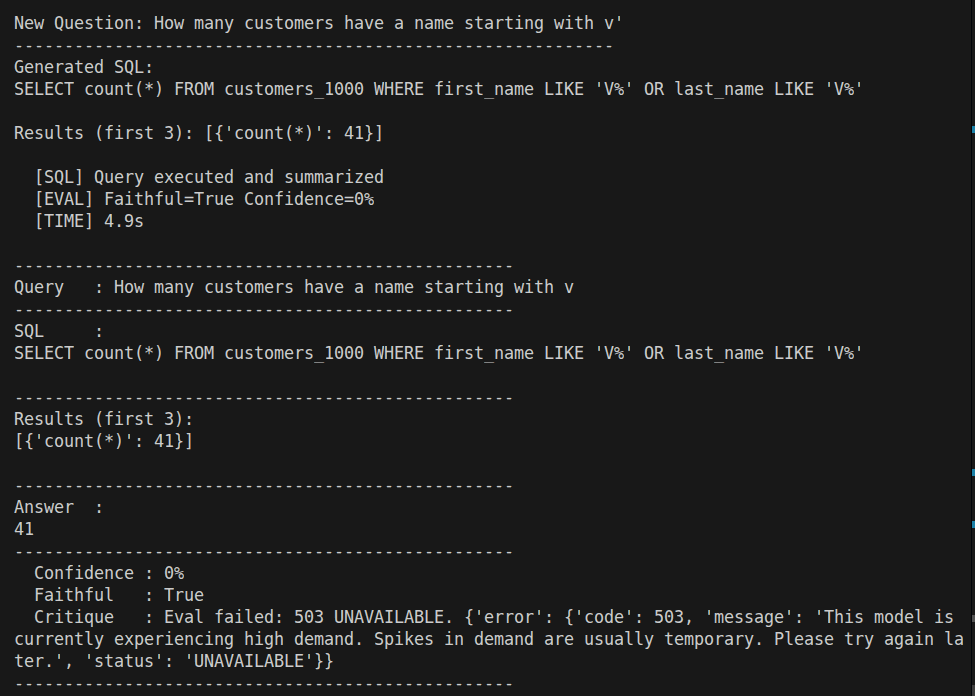
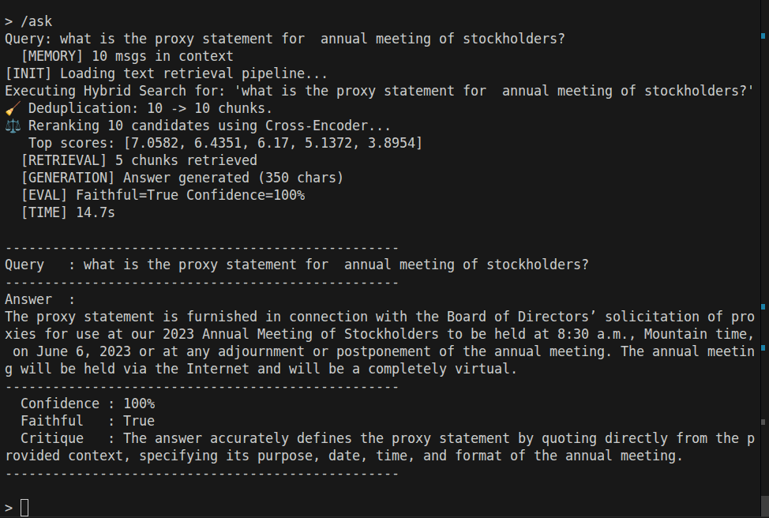
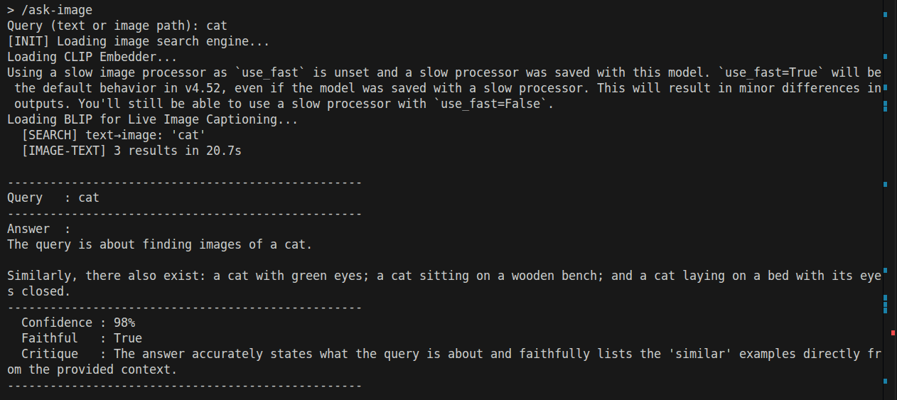
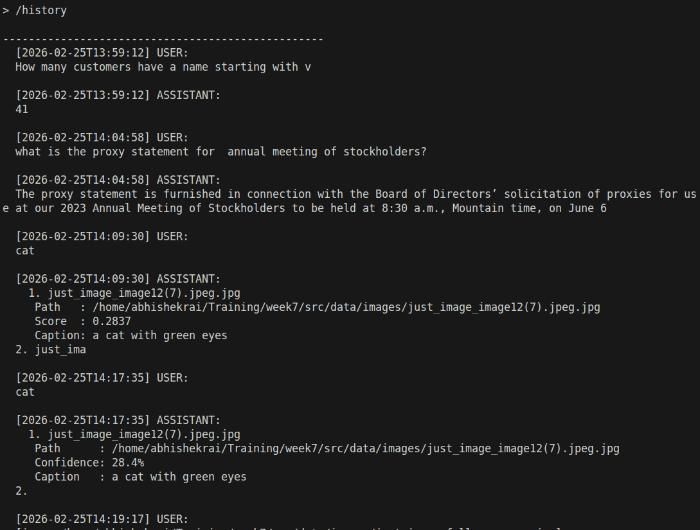

# DEPLOYMENT-NOTES.md — Day 5 Capstone

## Overview
The system is a unified CLI-based RAG engine exposing three endpoints: `/ask` (text RAG), `/ask-sql` (structured data), and `/ask-image` (multimodal retrieval). All three share a common memory, evaluation, and refinement layer.

## Architecture

**`/ask`** loads a `ContextBuilder` which runs hybrid retrieval (FAISS MMR + BM25 with manual RRF fusion), deduplicates exact-duplicate chunks, then applies cross-encoder reranking. The top chunks are injected into a Gemini prompt. The response is evaluated; if `is_faithful` is false, a stricter prompt is issued and the answer is regenerated and re-evaluated.

**`/ask-sql`** loads CSVs into an in-memory SQLite database. A `SQLGenerator` uses the schema to produce a SELECT query via Gemini. The results are fetched and summarised by a second LLM call. Unsafe DML/DDL is blocked at the generator level. Failed queries are auto-corrected once before returning an error.

**`/ask-image`** uses two separate FAISS indices built during ingestion. For text→image search, the query is embedded with CLIP and searched against a pure CLIP image embedding index (`image_index_clip.faiss`). For image→image search, the query image is captioned live with BLIP and also embedded with CLIP; the caption vector (60%) and image vector (40%) are fused and L2-normalised, then searched against the fused index (`image_index.faiss`). OCR text extracted from the query image is included in the prompt context when present.

## Memory
`MemoryStore` persists every interaction to `CHAT-LOGS.json` with a timestamp and evaluation metadata. The file is trimmed to the last 5 exchanges (10 messages) on every write, so it never grows beyond that limit. The last 5 exchanges are prepended to each prompt as conversational context.

A dedicated `/history` endpoint displays all stored exchanges with timestamps and roles at any point during the session, independent of the other endpoints.

## Human Feedback Logging
After any response, the `/feedback` endpoint prompts for a rating (1–5) and an optional comment. The feedback is written directly onto the last assistant entry in `CHAT-LOGS.json` under a `human_feedback` field containing the rating, comment, and timestamp. This allows post-hoc quality review without a separate storage layer.

## Evaluation & Self-Refinement
`RAGEvaluator` submits a structured judge prompt to Gemini and returns a JSON object with `is_faithful`, `confidence_score`, and `critique`. Refinement is two-tier: (1) if `confidence_score < 70`, the evaluator itself generates a `fixed_answer` via a second LLM call; (2) if `is_faithful` is false, the app re-runs the full generation with a stricter prompt and re-evaluates. The final answer is the evaluator's `fixed_answer` if present, otherwise the (re-)generated answer.

## Lazy Loading
Each pipeline (text retriever, SQL engine, image engine) is initialised only on first use via Python properties. This keeps startup time minimal and avoids loading unused models.

## Known Limitations
- The in-memory SQLite database is rebuilt on every run from source CSVs.
- The evaluator adds one additional LLM round-trip per query; this increases latency.
- Image→image search requires the query BLIP caption to be a good proxy for visual content, which may degrade on abstract or non-photographic images.

## Outputs

- /ask-image

- /ask-sql
 

- /ask
 

- /ask-image (via text)

- /history
