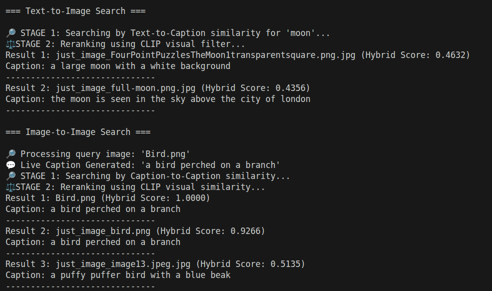

# Multimodal RAG & Image-RAG Architecture (Day 3)

## 1. The Core Philosophy (Two-Stage Multimodal Retrieval)
Pure visual retrieval using models like CLIP is brilliant for finding visual similarities, but it can struggle with very domain-specific or fine-grained differences. It often fails in enterprise environments because it lacks semantic understanding of hard facts, serial numbers, and nuanced concepts. 

To solve this, we treat **Text as the Anchor** and **Vision as the Filter**. We translate images into human language (via OCR and BLIP) so our database can confidently understand the content, and we use CLIP to ensure the final results visually align with the user's intent.

## 2. The Ingestion Pipeline (`image_ingest.py`)
Processing unstructured visual data requires a multi-layered extraction strategy before any math is calculated:
* **Optical Character Recognition (OCR):** Uses Tesseract to extract hard text embedded within diagrams, scanned PDFs, and forms. We apply grayscale preprocessing to enhance contrast and reduce hallucination rates.
* **Caption Generation (BLIP):** Uses Bootstrapping Language-Image Pre-training to "look" at the image and write a human-readable summary of the scene.
* **Vectorization (CLIP):** Transforms the raw pixels into a dense mathematical array, mapping the visual representation into the exact same spatial coordinates as its textual description.

All of this metadata (OCR, Caption, Filepath) is stored alongside the CLIP vector in the FAISS index.

## 3. Query Modes & Hybrid Search (`image_search.py`)
Our architecture supports intelligent, two-stage searching across different modalities:

* **Text -> Image:**
  1. *Stage 1 (Semantic):* Embed the user's text query using `SentenceTransformers` and find the top 10 images with the most mathematically similar stored Captions or OCR text.
  2. *Stage 2 (Visual):* Rerank those 10 candidates by computing the cosine similarity between the text's CLIP vector and the images' CLIP vectors, returning the top 3 visually verified matches.

* **Image -> Image:**
  1. *Stage 1 (Semantic):* Run the uploaded query image through BLIP (to generate a live caption) or Tesseract (to extract live OCR). Embed that new text and find the top 10 closest matches in the database.
  2. *Stage 2 (Visual):* Embed the raw query image using CLIP and rerank the 10 candidates based on structural visual similarity, returning the top 3.

## 4. Outputs

